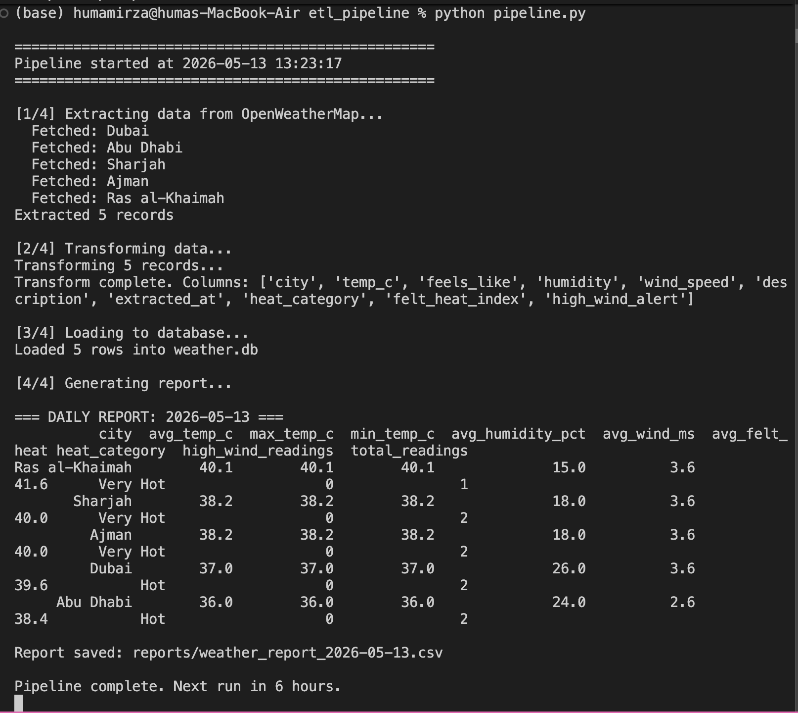

# UAE Weather ETL Pipeline

## What It Does

Automated ETL pipeline that runs every 6 hours:

1. Extracts live weather data for 5 UAE cities
   via OpenWeatherMap REST API
2. Transforms: cleans data, adds heat categories,
   calculates heat index, flags high-wind alerts
3. Loads: appends to SQLite database (grows over time)
4. Reports: auto-generates daily summary CSV

## Architecture

OpenWeatherMap API → extract.py → transform.py
→ SQLite (weather.db) → report.py → daily CSV

## Sample Output (Daily Report)

## Files

- extract.py — pulls data from OpenWeatherMap API
- transform.py — cleans, enriches, categorises data
- load.py — SQLite database operations
- report.py — SQL aggregation + CSV export
- pipeline.py — orchestrates all steps, runs on schedule

## How To Run

pip install requests pandas schedule
Add your API key to config.py
python pipeline.py

## Skills Demonstrated

Python · REST APIs · ETL Design · SQLite · SQL
Pandas · Data Cleaning · Automated Reporting
